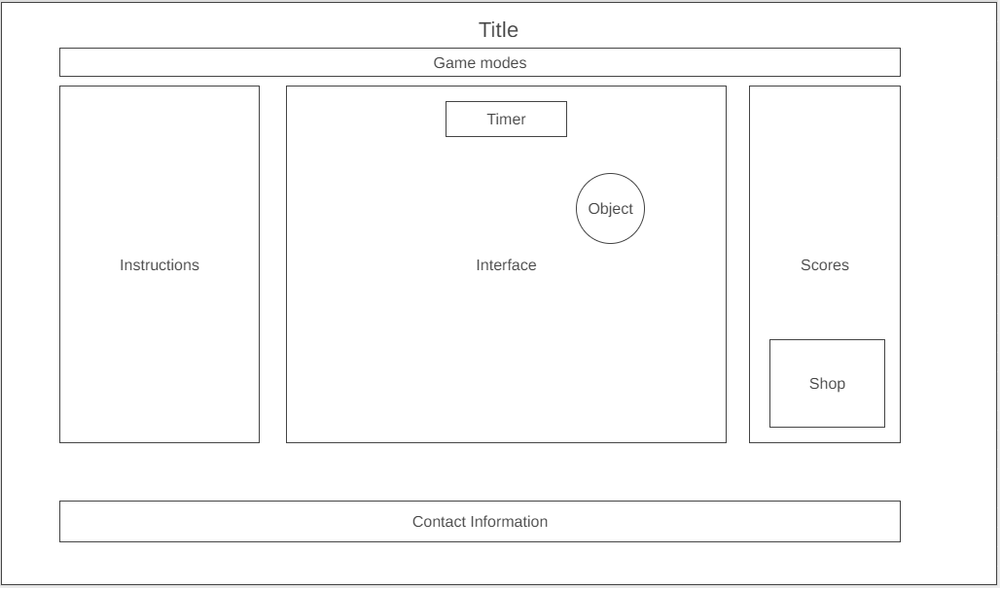

## Background
The goal of this game is to click on the circle on the screen before it 
disappears. It is similar to whack-a-mole, but it can also serve as a way 
to practice hand-eye coordination on the screen with the cursor. There are 
different settings to help ramp up the difficulty.

## Live Site - [ApeTrainer](https://james625.github.io/ApeTrainer/)

## Functionality & MVPs
In this aim trainer, users will be able to:

* Pick between different game modes
* Keep track of previous scores
* Adjust different settings (time, size, etc)
* Receive feedback on that round
* Unlock different designs to objects and cursor

In addition, this project will include:

* Instructions to how to start
* Production README
* Possible leaderboard

## Wireframes

## Technologies
This project will be created using canvas and vanilla JavaScript.

## Implementation Timeline
* Friday afternoon & Weekend\
    Set up canvas and implement a basic version where circles appear on the
    screen and can be clicked on. A timer and a basic scoring system will
    be added. Research three.js.
* Monday\
    Create buttons for different game modes and implement the logic behind 
    each button.
* Tuesday\
    Use CSS to brush up the interface and make sure everything is functional.
* Wednesday\
    Try to add bonus features and brainstorm additional bonus features. 
    Potentially use three.js.
* Thursday morning\
    Prepare for presentation.

## Bonus Features
* Have leaderboard that updates
* Create visual depth
* Move the objects to make the game harder
